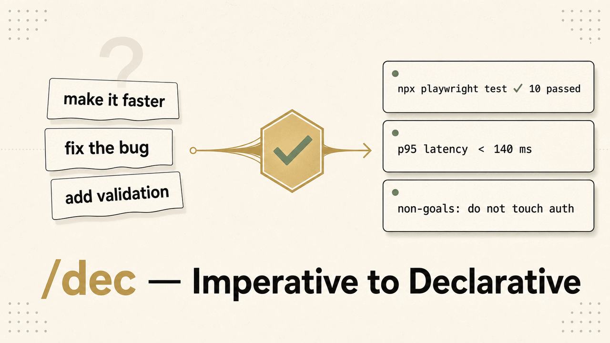

# saygoal

> **說出目標，看著它達成**——給 Claude Code 與 Codex 的宣告式 `/dec` + `/goal`，延續 Karpathy「給成功條件，然後看著它跑」的精神。



[English](./README.md) | 繁體中文（台灣） | [简体中文](./README.zh-CN.md) | [日本語](./README.ja.md)

> **主要 repo**：[`aeopress/saygoal.TW`](https://github.com/aeopress/saygoal.TW)（原於 [`yelban/andrej-karpathy-skills.TW`](https://github.com/yelban/andrej-karpathy-skills.TW) 維護，現已封存）

## 這是什麼

`saygoal` 把模糊的命令式請求轉成**可驗證的契約**，再讓 agent 自己 loop 到契約達成：

- **`/dec <任務>`** 把你的任務改寫成成功條件 + 驗證指令 + 邊界，並產出一條可直接貼上的 **`/goal` condition**。
- 把它貼進 Claude Code（或 Codex）內建的 **`/goal`**——一個小快模型每 turn 檢查 transcript，盯著 agent 做到條件成立為止。

**30 秒範例：**

```
/dec 修登入頁第一次載入時的閃爍

→ /goal "run npx playwright test login-flicker.spec.ts until it paste-shows 0 failures
         without changing the auth flow or any file outside the login component
         or stop after 20 turns"
```

`/dec` 寫契約；`/goal` 跑到綠燈。支援 **Claude Code**（`/dec` command）與 **OpenAI Codex**（`$dec` skill — 七欄位格式）。

→ [安裝](#安裝) · [運作原理](#dec--goal--工作流) · [為什麼規則檔不是重點](#為什麼規則檔不是重點--實證)

## `/dec` + `/goal` — 工作流

Karpathy 最強的洞見其實是**使用者端的紀律**，不是 LLM 自我約束的事：

> 「LLM 非常擅長循環執行直到達成特定目標⋯⋯不要告訴它該做什麼，給它成功標準然後看著它跑完。」

兩個 slash command 剛好對應 Karpathy 那句「給成功條件 + 看著它跑」的**兩個動詞**：

| | `/dec`（本倉庫） | `/goal`（Claude Code 內建，v2.1.139+） |
|---|---|---|
| 階段 | **動手前**：把模糊請求改寫成契約 | **動手中**：盯著 Claude 跑直到契約達成 |
| 動作 | 重寫使用者輸入、**不動手** | 每 turn 後讓小模型評估是否達標、沒達標自動進下一 turn |
| 持久度 | 一次性轉換、等你確認 | Session-scoped、直到 `/goal clear` |
| 評估者 | **你**（人工 review 契約） | **Haiku**（讀 transcript 自動判 yes/no） |
| Karpathy 動詞 | "give it success criteria" | "watch it go" |

### 何時宣告式勝過命令式

| 命令式（槓桿弱） | 宣告式（槓桿強） |
|---|---|
| 「加上輸入驗證」 | 「為這些無效輸入寫失敗測試，然後讓它們通過」 |
| 「修這個 bug」 | 「寫一個能重現 bug 的測試，然後讓它通過 — 其他測試必須還能過」 |
| 「讓它更快」 | 「把這個負載下的 p95 延遲壓到 X ms 以下；用 `scripts/bench.sh` 量」 |
| 「重構 X」 | 「重構 X 但不能改變可觀察行為；既有測試必須還能過」 |

- **宣告式**：有可觀察結果的功能、bug 修復、效能工作、有測試覆蓋的重構。
- **命令式**（跳過 `/dec`）：探索性編輯、UI 微調、文字創作、任何「完成」標準主觀的工作。

連同目標一起給 agent 驗證手段：測試指令、benchmark 腳本、lint 指令、給視覺檢查的 browser MCP。然後放手讓它迭代。

### 單獨用 `/dec`

`dec` 是 **declarative**（宣告式）的縮寫。指令把命令式需求改寫成契約；你確認後才會動工。

```
/dec 修登入頁第一次載入時的閃爍
```

回覆會給你成功條件（例如「Playwright 截圖比對 10 次、位移 < 2px」）、一條措辭成「Claude 必須實際執行並貼出輸出」的驗證指令、以及按需出現的邊界（不可改動 / 可寫路徑 / 外部系統限制）——**外加一條可直接複製貼上的 `/goal` condition**（自然語言的 `[做什麼] until [端狀態] without [約束] or stop after 20 turns` 句式）。若任務太主觀或太小，會回「不適用，建議直接做」、不硬轉換。適合單一 prompt 套用宣告式紀律、不需要自主迭代的場合（或在 Cursor / 舊版 Claude Code 沒有 `/goal` 時）。

### `/dec` 當作 `/goal` 的「邊界設定器」

`/goal` 的效果完全取決於你給它的 condition 字串。寫不好的 condition 永遠不會收斂：

```
❌ /goal "登入頁不要閃爍"
   Haiku 怎麼判定「不閃爍」？看截圖？讀 console？
   結果 evaluator 一律回 yes 或一律回 no、loop 永遠不收斂。

✅ /dec 修登入頁第一次載入時的閃爍
   →  成功條件：Playwright 截圖比對 10 次、位移 < 2px
       驗證指令：執行 `npx playwright test login-flicker.spec.ts` 並貼出顯示 0 failures 的輸出
       邊界：寫入限定在登入元件；不動 auth 流程

✅ /goal "run npx playwright test login-flicker.spec.ts until it paste-shows 0 failures
          without changing the auth flow or any file outside the login component
          or stop after 20 turns"
   Haiku 讀 transcript 內貼出的測試輸出能精準判定。
   Loop 真的會收斂。
```

`/dec` 強制設定 `/goal` 自己給不出的三件事：

1. **可機器判定的成功條件**——「diff < 2px」「10 passed」「p95 < X ms」evaluator 看 transcript 就能 yes/no
2. **嵌進契約的驗證指令**——強迫 Claude 真的去跑檢查、而不是靜態推理然後回報「應該可以了」（這正是我們 T4 declarative-loop 測試看到的失敗模式）
3. **結構化邊界（五面、按需）**——不可改動、可寫路徑、外部系統限制、何時暫停、回合上限。對 Claude 這些會編進 condition（「… without test files changed and no new files in src/legacy/, or stop after 20 turns」）；其中「何時暫停」單獨列出、建議用 Stop hook，因為 evaluator 判不了它。

### 完整 pipeline

```
1. /dec <模糊需求>                 ← 契約 + 一條編好的 /goal condition
2. 你 review 契約                  ← 人類確認方向
3. 複製 #1 那條 /goal 指令貼上     ← Haiku 接手當判官
4. Claude 自主 loop 到收斂          ← Karpathy 說的「watch it go」
```

### Codex `/goal` 也適用

OpenAI 的 Codex CLI 比 Claude Code 早 11 天，在 [v0.128.0（2026-04-30）](https://developers.openai.com/codex/cli/slash-commands) 推出自家的 `/goal`。Codex [官方 goal 寫法指南](https://developers.openai.com/codex/use-cases/follow-goals)列出好的 goal 應該明確的四件事：

> "what Codex should achieve, what it shouldn't change, how it should validate progress, and when it should stop"

並明確指出 **"Codex should know what 'done' means before it starts."** 這正是 `/dec` 寫出來的契約：

| Codex docs 要求 | `/dec` 對應輸出（Codex 七欄位） |
|---|---|
| what Codex should achieve | **Outcome** |
| what it shouldn't change | **Constraints + Boundaries** |
| how it should validate progress | **Verification** |
| when it should stop | **Stop when + Pause if** |

開 Codex `/goal` 之前先跑 `dec` 的三個 confirmed value：

1. **你不用記 Codex 那條 checklist**——`/dec` 的 template 每次都把七個 Codex 欄位（outcome、verification、constraints、boundaries、iteration policy、stop、pause）填滿。
2. **`/dec` 要求每個欄位都可量測**——[`plugin/commands/dec.md`](./plugin/commands/dec.md) 要求「可驗證的端狀態，且必須是 `/goal` 的 evaluator 在 transcript 裡找得到的證據：指令退出碼、輸出比對、可量化門檻」。Codex docs 雖然主張 goal 應該可測試，但沒附樣板在 user 端強制執行這件事。
3. **`/dec` 對主觀任務的「不適用，建議直接做」short-circuit**（UI 微調、文案、單行 rename）—— Codex `/goal` 沒有 documented 等價功能。對主觀任務開 `/goal` 正是 Codex docs 警告的：**"Avoid using a goal for a loose list of unrelated work."**

**`dec` 與 Codex 搭配使用**：本倉庫也提供 Codex 版的 `dec` skill（透過 Codex plugin 打包，位於 [`plugins/saygoal`](./plugins/saygoal)），輸出 Codex 的七欄位 `/goal` 模板（Claude command 則輸出單一條自然語言 condition——兩邊各自產出宿主的原生格式）。在 Codex CLI 可用 `$dec <request>` 叫用，或透過 `/skills` 選取；它輸出的 `/goal` 區塊可以直接貼到 Codex `/goal "..."`。這不會改變 Claude Code 的 `/dec`：原本的 command 仍在 [`plugin/commands/dec.md`](./plugin/commands/dec.md)，也仍然使用 Claude 的 `$ARGUMENTS` template。

> **Caveat——這是設計層面的聲明、不是實證。** 我們**沒有**對 `/dec` + Codex `/goal` 跑控制組實驗。上面的對應是讀 `/dec` 的 prompt template 對照 Codex [published goal-writing guidance](https://developers.openai.com/codex/use-cases/follow-goals) 推得。[`EXPERIMENT.md`](./EXPERIMENT.md) 那個 N=40 A/B 測的是 CLAUDE.md 對 Opus 4.7 的效應、不是 `/dec` 本身。

> **呼叫名稱注意**：透過外掛（選項 A）安裝時，Claude Code 會把指令 namespace 成 `/saygoal:dec`。想要短的 `/dec`，請用選項 C 手動安裝。內建的 `/goal` 不受安裝方式影響、永遠可用。

> **`/goal` 評估者注意**：`/goal` 把每 turn 的 transcript 餵給 Claude Code 內建的「small fast model」slot、[預設是 Haiku](https://code.claude.com/docs/en/goal.md)。**沒有 `/goal` 專屬的 model 設定**；唯一替換方式是用 `ANTHROPIC_DEFAULT_HAIKU_MODEL` 環境變數整體 redirect 那個 slot（[model config 文件](https://code.claude.com/docs/en/model-config.md)）——但這會把 `haiku` alias 全部換掉、不只 `/goal`。一般使用不需動。

## 安裝

### Claude Code

```
/plugin marketplace add aeopress/saygoal.TW
/plugin install saygoal@saygoal
```

裝好後用 `/saygoal:dec <任務>`。內建 `/goal` 永遠可用、不需安裝。

### Codex

clone 本 repo 後、在 root 執行：

```
codex plugin marketplace add .
codex plugin add saygoal@saygoal
```

用 `$dec <任務>`（或從 `/skills` 選），再把產出的 `/goal "..."` 貼進 Codex 內建 `/goal`。

<details>
<summary><b>進階</b> — 短 <code>/dec</code>、可選的 <code>CLAUDE.md</code> 規則、自動更新、Cursor</summary>

**短 `/dec`（免 namespace）。** 外掛會把指令 namespace 成 `/saygoal:dec`。想要短的 `/dec`，把指令檔放到全域：

```bash
mkdir -p ~/.claude/commands
curl -o ~/.claude/commands/dec.md \
  https://raw.githubusercontent.com/aeopress/saygoal.TW/main/plugin/commands/dec.md
```

**三條 `CLAUDE.md` 規則（可選）。** 我們的 [A/B 實證](./EXPERIMENT.md) 顯示對 Opus 4.7/4.8 沒有可測量效應——想要才裝：

```bash
curl -o CLAUDE.md https://raw.githubusercontent.com/aeopress/saygoal.TW/main/CLAUDE.md
# 或只把規則追加到既有 CLAUDE.md：
# curl -s https://raw.githubusercontent.com/aeopress/saygoal.TW/main/CLAUDE.md | sed -n '/^## Stop when confused/,$p' >> CLAUDE.md
```

**自動更新的短 `/dec`。** clone 一次再 symlink，`git pull` 就會保持最新：

```bash
mkdir -p ~/.claude/external ~/.claude/commands
git clone https://github.com/aeopress/saygoal.TW ~/.claude/external/saygoal.TW
ln -sf ~/.claude/external/saygoal.TW/plugin/commands/dec.md ~/.claude/commands/dec.md
# 之後更新：cd ~/.claude/external/saygoal.TW && git pull
```

**Cursor。** 本倉庫附 [`.cursor/rules/karpathy-guidelines.mdc`](.cursor/rules/karpathy-guidelines.mdc)（`alwaysApply: true`）；詳情見 [`CURSOR.md`](./CURSOR.md)。

</details>

## 為什麼規則檔不是重點 — 實證

`saygoal` 也附一份三行的 `CLAUDE.md`（內容衍生自 [Andrej Karpathy 對 LLM 編碼陷阱的觀察](https://x.com/karpathy/status/2015883857489522876)）。它是可選的，而 A/B 實證說**規則檔幾乎不動模型**——槓桿在 `/dec` + `/goal`。本節是證據，當背景看即可。

### 現況（Opus 4.8 時代 · 2026 年 5 月）

Anthropic 自己的 Claude Code 提示詞、演進方向跟這個 skill 一模一樣。v1→v2 拿掉了模型已內化的 explicit guardrail（66 行 → 19 行）。Opus 4.7 已經把大部分 guardrail 塞進一份冗長的系統提示詞；**Opus 4.8（2026-05-28）更進一步、改用 *lean* prompt 把它們整段拿掉**——這些規則現在活在 post-training（model weights）、不在 prompt 文字裡。

我們在 4.8 上重跑了 A/B（T1、N=10）：抓 bug 率從 **33% 躍升到 90%**、而三組 `CLAUDE.md`（v1／v2／無）統計上仍持平。模型把紀律吸收進去了；剩下的槓桿在使用者端——`/dec` + `/goal`。**新版刻意只保留系統提示詞還未涵蓋的部分。** 舊版完整四原則保留在 [`archived/v1/`](./archived/v1/) 供參考。

### 給 LLM 看的三條 reminder

三條 reminder，與 [`CLAUDE.md`](./CLAUDE.md) 完全一致。保留是因為成本低、在不同模型或更長的上下文中可能仍有用；但在 Opus 4.7 上實證邊際效應不顯著（見 [`EXPERIMENT.md`](./EXPERIMENT.md)）。

1. **困惑時停下** — 請求語意不清時，明確指出哪裡不清楚並提問；不要默默挑一個解讀就動手。
2. **每一行改動都要對應到請求** — 回報完成前，重看自己的 diff；任何沒有直接服務使用者目標的行就刪掉。
3. **以宣告式目標跑 loop** — 當存在可驗證的終態時，自主驅動直到達成。

整個指令檔就這樣。Karpathy 列出的其他陷阱（過度複雜化、順手重構、推測性功能、死碼累積、刪掉模型「看不順眼」的註解⋯⋯）都已經被 Claude Code 預設系統提示詞涵蓋；在這裡重述只會稀釋訊號。

### 哪些 v1 規則被歸到哪裡

[上游 v1](./archived/v1/CLAUDE.md) 有 4 大原則 × 每個 4–6 條 sub-rule（共 66 行）。v2 只剩 19 行。下表是**逐字驗證**過的對照——第三欄每一格都是我們在實際 Claude Code session 直接觀察到的系統提示詞原文，不是改寫過的近似句。[^sysprompt]

> **更新——Opus 4.8（2026-05-29）：** 4.8 把 **lean system prompt** 設為 default、下表第三欄那**八條 quote 在 4.8 全部消失了**——4.7 的 `# Doing tasks` / `# Executing actions with care` 大段被壓縮成 5 條 bullet 的 `# Harness`。這**不推翻**論點——我們在 4.8 上重跑了實驗確認。T1（N=10、固定 automated scorer）上「兩 bug 都修」從 **33% 躍升到 90%**（Fisher p=1.1e-5、少漏約 6.7 倍、吻合 Anthropic「漏放瑕疵機率低約 4 倍」），而三組（v1 65 行／v2 19 行／無 `CLAUDE.md`）**統計上仍持平**（兩兩 p ≥ 0.47）。也就是 guardrail 從 *prompt* 移到了 *post-training（model weights）*、不是消失——CLAUDE.md flavor 依然測不出效應。重述模型已內化的規則仍是浪費訊號、而 prompt 越乾淨、19 行的檔案越容易保持精準。完整 4.7→4.8 diff 見 [`2026-05-29-opus-4.8-cli.md`](./archived/observed-system-prompts/2026-05-29-opus-4.8-cli.md)；重跑資料與 caveat 見 [`EXPERIMENT.md`](./EXPERIMENT.md)（§ Opus 4.8 re-run）。下表因此是**對 4.7 歷史準確**（已獨立驗證）、並加註說明、不是默示它符合當前 default prompt。

| v1 條文 | v2 處置 | 系統提示詞逐字 quote |
|---|---|---|
| **Simplicity First** — 不加超出請求範圍的功能 | 刪 | "Don't add features, refactor, or introduce abstractions beyond what the task requires" |
| **Simplicity First** — 單次使用的程式碼不抽象 | 刪 | "Three similar lines is better than a premature abstraction" |
| **Simplicity First** — 不加沒人要的 flexibility / configurability | 刪 | "Don't design for hypothetical future requirements" |
| **Simplicity First** — 不為不可能發生的場景寫錯誤處理 | 刪 | "Don't add error handling, fallbacks, or validation for scenarios that can't happen. Trust internal code and framework guarantees. Only validate at system boundaries" |
| **Surgical Changes** — 不順手改鄰近程式碼 | 刪 | "A bug fix doesn't need surrounding cleanup; a one-shot operation doesn't need a helper" |
| **Surgical Changes** — 沒人要你改前不要刪掉既有死碼 | 刪 | "Avoid backwards-compatibility hacks like renaming unused _vars... If you are certain that something is unused, you can delete it completely" |
| **Surgical Changes** — 每一行改動都要對應到請求 | **保留**（重新命名） | *（無對應——這條是 v2 真正補強的）* |
| **Think Before Coding** — 整個原則（4 條 sub-rule） | **3 刪 1 留**（留下的改名 Stop when confused） | *（無逐字對應——見下方說明）* |
| **Goal-Driven Execution** — TDD 範例 + 多步計畫格式 | **改寫**為 Loop on declarative goals | *（無對應——這是 Karpathy 真正的洞見、留下但重新詮釋）* |

關於 **Think Before Coding** —— 我們刪了它的三條 sub-rule（「明確說出假設」「列出多種解讀」「合理時要 push back」），但這三條**並非**逐字被系統提示詞涵蓋。最接近的段落是 `"For exploratory questions, respond in 2–3 sentences with a recommendation and the main tradeoff. Present it as something the user can redirect"`——意圖相近、但**不是完整替代**。我們還是刪了，因為 [A/B 實證](./EXPERIMENT.md) 顯示放入完整四條版本也沒能可靠觸發「停下來問」（T1 共 30 runs 中 0 次在動手前問澄清）。唯一保留的「不確定時停下來問」是因為它的動作最乾淨（直接停），不是因為其他三條被覆蓋。**這格是設計判斷、不是「逐字重複所以刪」的主張。**

#### 刪除的三個具體好處

1. **訊號去稀釋**。在 `CLAUDE.md` 重述系統提示詞已有的內容，會給模型已經會做的事再加一份權重；新加進來的規則就要跟這些重複條目搶注意力。v2 的每一行都在說系統提示詞**沒說**的事。
2. **降低非編碼任務的誤觸**。v1 的 TDD-first 範例（「為無效輸入寫測試、再讓它通過」）寫死了可測試情境。UI 微調、文案、設定檔編輯都沒有測試可寫——v1 框架會逼模型，在不該發明驗證條件的地方發明驗證條件。v2 的 `## Loop on declarative goals` 改成把驗證條件的決定權還給使用者、不規定格式。
3. **「更短不會更糟」的實證背書**。[N=40 A/B 測試](./EXPERIMENT.md) 顯示在 Opus 4.7 上、v1（65 行）／v2（19 行）／無 `CLAUDE.md` 三組無統計顯著差異。刪到只剩 19 行不會可測量地變差——而且檔案越短、與專案規則衝突時的 review 成本越低。

#### policy / mechanism 分離

Karpathy 列的陷阱中、v2 *沒有*刪掉的那條最重要：**`Loop on declarative goals`**。它能活下來、第一個原因是系統提示詞沒涵蓋——但更關鍵的原因是、這件事的槓桿在**使用者端**、不在 LLM 自我約束。這也是為什麼 saygoal 提供 `/dec`：一個把命令式請求改寫成宣告式契約的 slash command、搭配內建的 `/goal` evaluator（詳見上方 [工作流](#dec--goal--工作流)）。

這個「policy / mechanism 分離」——LLM 處理「想要什麼」（high-level intent）、工具處理「怎麼達成」（deterministic execution）——在 2025–2026 的研究文獻中已經收斂成主流範式（[arxiv 2510.04607](https://arxiv.org/html/2510.04607v2)、[PDL arxiv 2410.19135](https://arxiv.org/pdf/2410.19135)）。`/dec` 是這個範式在 prompt 工程層的對應介面。

### A/B 實證告訴我們什麼

上方那張 v1→v2 逐字對照表是「為什麼新版這麼短」的論證——v1 大部分內容已在系統提示詞裡。但這是觀察判斷、不是量測。所以 2026 年 5 月我們跑了小型 A/B 實證：

- 3 組：無 CLAUDE.md / v1 上游版（65 行）/ v2 我們版（19 行）
- 4 個誘發 Karpathy 痛點的 toy task + 最區分維度 T1 ambiguous-bug 加碼到每組 N=10
- 受測模型：Opus 4.7；盲判官（blind judge）：Sonnet 4.6

**結果：三組沒有統計顯著差異。** T1 加碼到每組 N=10 後三組全部 7/10 正確、Fisher exact p = 1.000。30 次 runs 中 **0 次**在編輯前問澄清（clarification）——不論哪版規則都沒能可靠觸發「停下來問」。

誠實版結論：在這個 toy task 規模上、CLAUDE.md（不論哪版）對 Opus 4.7 行為的邊際效應**小到 N=10 測不出來**。**任選一版皆可；使用者端的宣告式描述方式（user-side declarative framing，就是 `/dec` 在做的事）槓桿可能比規則檔本身大。**

完整資料、scripts、caveats、以及 Phase 1 (N=3) 一度看起來「v1 顯著優於 v2」最後被 Phase 2 (N=10) 攤平的過程：[`EXPERIMENT.md`](./EXPERIMENT.md)（英文）。

## 與上游的關係

本倉庫是 [`forrestchang/andrej-karpathy-skills`](https://github.com/forrestchang/andrej-karpathy-skills) 的繁體中文（台灣）在地化 fork，為 Claude Code Opus 4.7 → 4.8 時代更新內容。Plugin / marketplace 命名為 `saygoal`；README 為雙語（英文 + 繁體中文）。

## 授權

[MIT](./LICENSE) — Copyright © 2026 yelban。

詳細出處說明見[與上游的關係](#與上游的關係)章節。

[^sysprompt]: 第三欄的逐字 quote 是 2026-05-28 在 Claude Code CLI session 直接觀察到的 Opus 4.7 系統提示詞。完整觀測 snapshot 存於 [`archived/observed-system-prompts/2026-05-28-opus-4.7-cli.md`](./archived/observed-system-prompts/2026-05-28-opus-4.7-cli.md)（英文）——該檔案說明系統提示詞與 `CLAUDE.md` 注入，在 session 結構中如何位置上可分離，並把表格每一條 quote 都對應到 snapshot 內精確位置。**Opus 4.8（2026-05-29）改用 lean prompt、把這八條 quote 全部拿掉**——4.7→4.8 diff 見 [`2026-05-29-opus-4.8-cli.md`](./archived/observed-system-prompts/2026-05-29-opus-4.8-cli.md)。Claude Code 系統提示詞是 runtime 注入、Anthropic 並未公開文件化；措辭隨 CLI／模型更新改變（4.7→4.8 是一次大改）。
